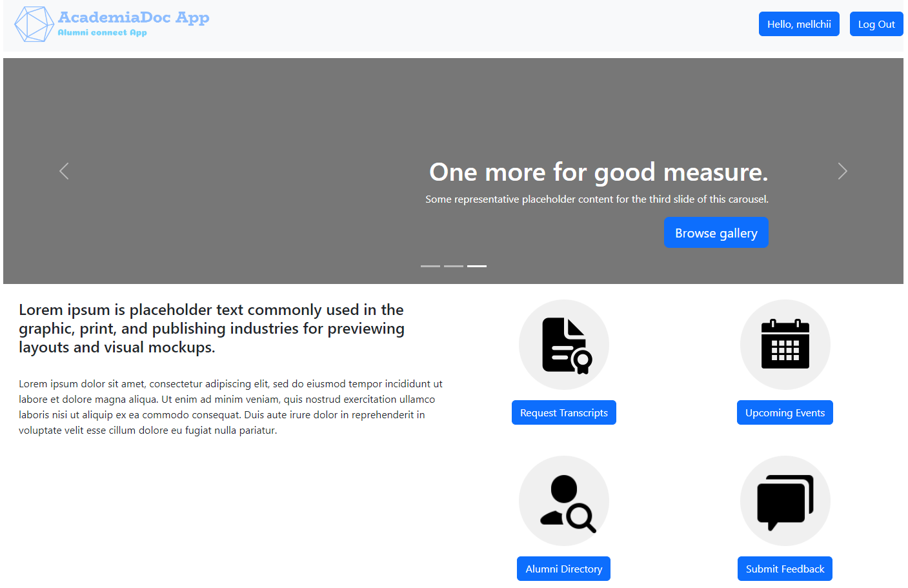

# team-project-cs633ols23team3

This is the repository for the CS633 OL Spring1 2023 Term Project for Team 3.
thank you for starting this repository ! good luck with the project !

# AcademiaDoc

## TEAM 3

> This is a web application which allows Alumni of a school to submit requests for Transcripts. Users can track the request status until a digital copy of the Transcript is receieved. Users can also view upcoming Alumni events.

## .

## Requirements (Prerequisites)

Tools and packages required to successfully install this project:

- Python 3.3 and up [Install](https://www.python.org/downloads/)
- Github Desktop / Git Bash [Install](https://git-scm.com/downloads)

## Installation

Follow the steps below to install an instance of this project.

- **Step 1:** Clone the git repo (Open your teminal and navigate to the directory you wish to store the project and run the following command)
  - `git clone https://github.com/BUCS633OLS1Team3/team-project-cs633ols23team3.git`
- **Step 2:** Navigate into the repository. Create a virtual environment and activate it as follows:
  - Install virtual environment `pip install virtualenv`
  - Make your virtual environment `virtualenv venv`
  - Activate your virtual environment as below:
    - For Linux/Unix OS: `source venv/Scripts/activate`
    - For Windows OS: `venv\Scripts\activate`
- **Step 3:** Install requirements
  - `pip install -r requirements.txt`
- **Step 4:** Migrate Database
  - `python manage.py migrate`
- **Step 5:** Create superuser for access to database admin (follow prompts to set username, password)
  - `python manage.py createsuperuser`
- **Step 6:** Run the local server
  - `python manage.py runserver`
- **Step 7:** Navigate to the link below in your browswe to see the output
  - `http://127.0.0.1:8000/`

## Screenshots

.

## Features

Some unique features of the application are listed below:

- List of key functionalities here>>>

## Tech Stack / Built With

List of technology / frameworks / tools used in this project.

1. [Django](https://www.djangoproject.com/) - The Python-based web framework
2. [Bootstrap](https://getbootstrap.com/) - CSS framework directed at responsive, mobile-first front-end web development.
3. [jQuery](https://jquery.com/) - JavaScript library designed to simplify HTML DOM tree traversal and manipulation.

## ✍Authors

### **CS633OLS23P3:**

    Delaney Sullivan    – Team Lead
    Catherine Ayerowni  – Requirement Manager
    Ekta Gandhi         – Developer
    Gabriel Ako         – Developer/Configuration/UX
    Jabey Chiang        – UI/UX Designer
    Onkar Awhad         – Quality Assurance
    Rinkal Bhatia       – Scrum Master

## Additional Information

Team Facilitator `Professor Alex Elentukh`.

### License

#### MIT © Team 3
